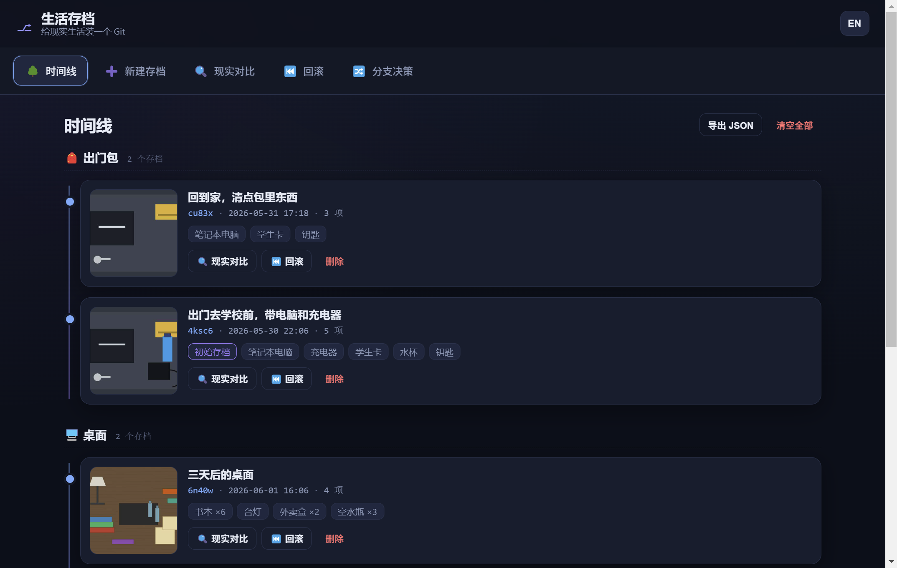
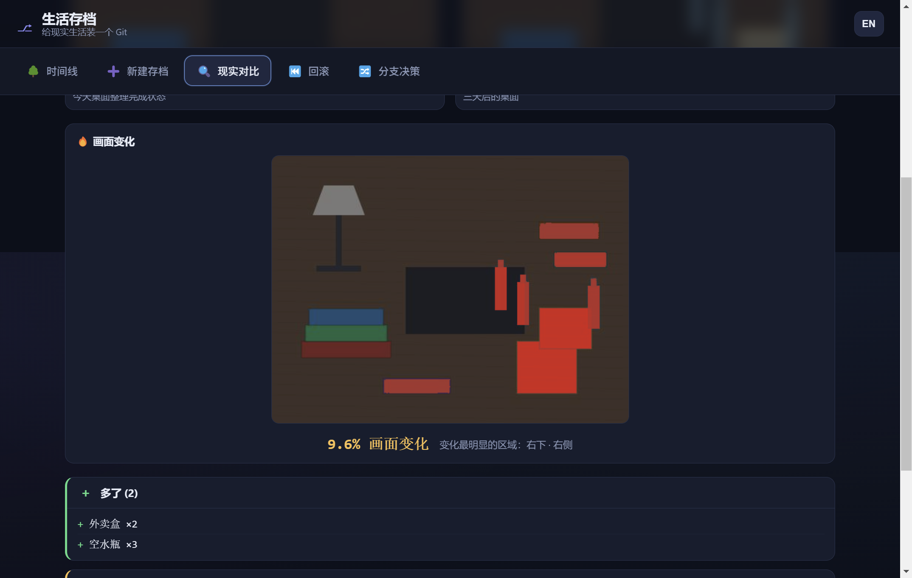
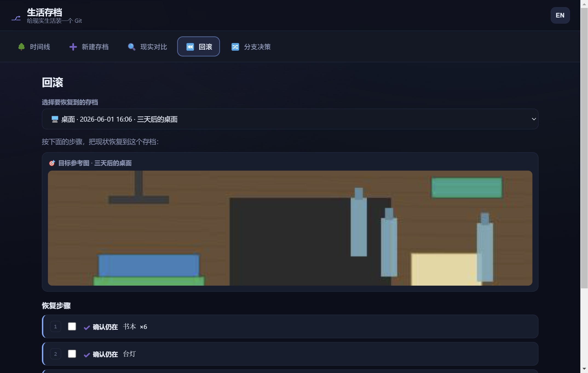
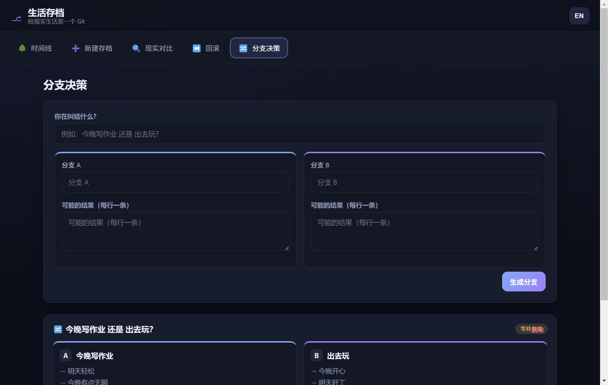

<h1 align="center">Life Archive · 生活存档</h1>

<p align="center">
  <b>给现实生活装一个 Git —— 存档、对比、回滚、分支。</b><br>
  <i>Version control for everyday life — commit, diff, rollback, branch.</i>
</p>

<p align="center">
  <a href="https://github.com/ChristoGoodrich/RealityGit/releases/latest"></a>
  &nbsp;
</p>

<p align="center"></p>

---

## 这是什么

现实生活最大的问题是：**很多事发生后才发现乱了，但你已经不知道怎么恢复。**
房间不知不觉乱了、出门忘带东西、作业改着改着改偏了、小组分工没人记得最初答应了什么……

普通 App 只是提醒你「要做什么」。**Life Archive 换了个思路：像管理代码一样管理生活状态。**
你可以给现实拍一个「存档点（commit）」，过几天对比「之前 / 现在」哪里变了，再按旧版本一步步把秩序「回滚」回来。

> 别人管理*任务*，它管理*生活状态*；别人帮你*计划未来*，它帮你*保存过去、对比现在、恢复秩序*。

---

## 下载

👉 **[前往 Releases 页面下载最新版](https://github.com/ChristoGoodrich/RealityGit/releases/latest)**

| 文件 | 说明 |
|------|------|
| `LifeArchive-Setup-x.x.x.exe` | **安装版（推荐）**——双击安装，进开始菜单，**支持自动更新** |
| `LifeArchive-portable.exe` | **免安装单文件**——直接双击运行，适合拷给别人 |

> 首次运行 Windows 可能提示「未知发布者」，点 **更多信息 → 仍要运行** 即可（应用未做代码签名，属正常现象）。
> 数据全部保存在本地，离线即可使用，无需注册、无需联网。

---

## 五个功能

### 🔍 现实对比（核心）
拍「之前」和「现在」两张照片，自动告诉你哪里变了：**①像素热力图**标出画面里变化最集中的区域，**②语义清单 diff**列出少了什么 / 多了什么 / 数量变化。

<p align="center"></p>

### 🌳 时间线
按场景（出门包 / 桌面 / 房间 / 作业…）分组的 git 式提交图，每条 commit 都有 hash、时间、物品清单和一句 commit message。

### ⏮️ 回滚
选一个旧存档当目标，自动生成「恢复到这个状态」的分步清单（拿走 X、放回 Y），可逐项打勾。

<p align="center"></p>

### 🔀 分支决策
纠结时开两个 branch，写下每条路的预期结果，选一条，事后回来复盘评分，慢慢攒出你自己的「生活决策版本库」。

<p align="center"></p>

### ➕ 新建存档
拍照 / 上传文件 + 写一句 commit message + 列出物品清单，生成一个生活存档点。

---

## 技术 & 设计

- **核心是一个纯前端、零依赖、可离线的网页 App**（`index.html` + `css/` + `js/`），直接双击就能跑。
- 桌面版用 **Electron** 套壳打包成 Windows 安装包；**electron-updater + GitHub Releases** 实现云端自动更新。
- **为什么 Diff 不需要 AI 视觉？** 它是两条互补的对比：图像 diff（`js/diff.js` 逐像素求差 + 3×3 网格定位）告诉你**哪里**变了；清单 diff（结构化集合比较）告诉你**什么**变了，稳定可靠、不依赖识别。

```
index.html        外壳 + 顶栏 + 导航
css/styles.css    暗色「git 客户端」主题
js/store.js       localStorage 仓库层
js/diff.js        Reality Diff 引擎（热力图 + 清单对比）
js/app.js         UI / 路由 / 中英双语 / 各页面渲染
main.js           Electron 桌面外壳 + 自动更新
```

---

## 本地开发 / 发布

```bash
# 浏览器里跑（开发）
直接双击 index.html，或用任意静态服务器打开

# 桌面版（需要 Node.js）
npm install
npm start                 # 以 Electron 桌面应用启动
npx electron-builder --win  # 构建 Windows 安装包到 dist/
```

发布新版本 = 双击项目里的 **`发布新版本.bat`**（改版本号 → 自动构建 → 上传 GitHub Release）。
详细步骤见 [RELEASING.md](RELEASING.md)。

---

<p align="center"><sub>仓库代号 <code>RealityGit</code> · MIT License</sub></p>
